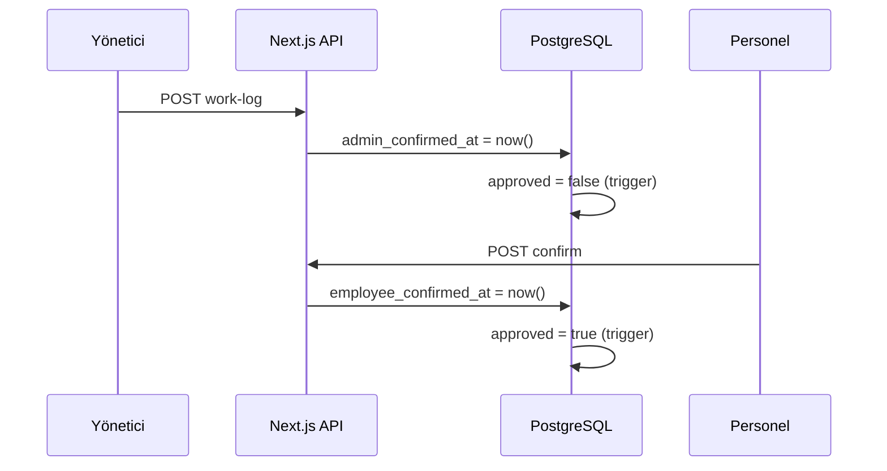

# 03 — Sistem Mimarisi

## Üst düzey mimari

CrewLedger **üç katmanlı** bir web uygulamasıdır:

```
┌──────────────────────────────────────────────────────────────────┐
│                        İstemci (Browser / PWA)                    │
│  React 18 · Next.js App Router · Tailwind CSS · Service Worker   │
└────────────────────────────┬─────────────────────────────────────┘
                             │ HTTPS
┌────────────────────────────▼─────────────────────────────────────┐
│                   Next.js 15 Sunucu Katmanı                       │
│  ┌─────────────┐  ┌──────────────┐  ┌─────────────────────────┐ │
│  │ App Routes  │  │ API Routes   │  │ Middleware              │ │
│  │ (SSR/RSC)   │  │ /api/*       │  │ Auth · session refresh  │ │
│  └─────────────┘  └──────────────┘  └─────────────────────────┘ │
│  ┌─────────────────────────────────────────────────────────────┐ │
│  │ src/lib/* — iş mantığı servisleri                           │ │
│  └─────────────────────────────────────────────────────────────┘ │
└────────────────────────────┬─────────────────────────────────────┘
                             │ Supabase client (anon / service_role)
┌────────────────────────────▼─────────────────────────────────────┐
│                         Supabase                                  │
│  PostgreSQL · Auth · Storage · RLS · RPC · Triggers              │
└──────────────────────────────────────────────────────────────────┘
```

---

## Dizin yapısı (özet)

```
personel-main/
├── src/
│   ├── app/                    # Next.js App Router sayfaları
│   │   ├── admin-panel/        # Yönetici UI
│   │   ├── personnel-panel/    # Personel UI
│   │   ├── developer-panel/    # Platform UI
│   │   ├── api/                # REST API route handlers
│   │   └── (marketing)/        # Ana sayfa
│   ├── components/             # React bileşenleri
│   ├── hooks/                  # Client hooks
│   ├── lib/                    # İş mantığı, auth, şifreleme
│   ├── config/                 # Menü, sabitler
│   └── types/                  # TypeScript tipleri
├── supabase/
│   └── migrations/             # SQL migration dosyaları
├── public/                     # Statik dosyalar, PWA SW
└── docs/                       # Bu dokümantasyon seti
```

---

## Kimlik doğrulama mimarisi

İki ayrı oturum modeli kullanılır:

### Yönetici (Supabase Auth)

- E-posta + şifre ile `auth.users` tablosu
- `profiles` tablosu ile rol (`admin`, `developer`, `owner`)
- Middleware: `is_admin()`, `is_developer()` RPC
- Cookie: Supabase SSR session

### Personel (Özel oturum)

- PIN + e-posta veya T.C. kimlik ile giriş
- `personnel_sessions` tablosu + HttpOnly cookie
- Token hash ile doğrulama (`validate_personnel_session` RPC)
- Sliding expiration (30 gün içinde yenileme)

```
┌─────────────┐     ┌──────────────────┐     ┌─────────────────┐
│ Admin login │────►│ Supabase Auth JWT │────►│ profiles.role   │
└─────────────┘     └──────────────────┘     └─────────────────┘

┌─────────────┐     ┌──────────────────┐     ┌─────────────────┐
│Personel login│───►│ personnel_sessions│────►│ employees       │
└─────────────┘     │ + HttpOnly cookie │     └─────────────────┘
                    └──────────────────┘
```

---

## Veri erişim modeli

| Katman | Supabase anahtarı | Kullanım |
|--------|-------------------|----------|
| Tarayıcı (admin) | `anon` + kullanıcı JWT | RLS korumalı sorgular |
| API route (personel) | `service_role` | Kontrollü sunucu erişimi |
| API route (admin) | `server` client | Proje sahipliği kontrolü |

**Kural:** Hassas personel verisi (T.C., IBAN) istemciye şifresiz gönderilmez; API decrypt eder veya maskeler.

---

## Çift onay veri akışı



İtiraz durumunda `employee_disputed_at` dolar; admin düzeltince dispute alanları temizlenir ve döngü tekrarlanır.

---

## Asgari ücret veri akışı

```mermaid
flowchart LR
    WP[wage_policies] --> CALC[wage-policy-calc]
    WL[work_logs onaylı] --> CALC
    MW[minimum_wages] --> CALC
    CALC --> ADMIN[Admin Asgari sayfası]
    CALC --> API[/api/personnel/asgari]
    API --> PANEL[Personel Asgari sekmesi]
```

---

## Dağıtım mimarisi

| Bileşen | Platform |
|---------|----------|
| Next.js uygulaması | Vercel (serverless functions) |
| Veritabanı | Supabase Cloud |
| Dosya depolama | Supabase Storage (private bucket) |
| E-posta (OTP) | Brevo API |
| Rate limit (opsiyonel) | Upstash Redis |

---

## Ölçeklenebilirlik notları

- API route’lar stateless; yatay ölçek Vercel ile mümkün
- Ağır hesaplar PostgreSQL RPC’de (`get_personnel_month_stats`)
- Proje izolasyonu `created_by` + RLS ile kiracı sınırı
- Migration tabanlı şema evrimi — production’da sıralı uygulama zorunlu

---

## İlgili belgeler

- [Teknoloji Yığını](./04-TEKNOLOJI-YIGINI.md)
- [Veritabanı](./05-VERITABANI.md)
- [Güvenlik](./06-GUVENLIK-VE-KVKK.md)
